<div align="center">

# 🏡 Homely

**A real-estate marketplace where licensed realtors publish listings and clients find a home they'll love.**

Laravel 13 REST API · Nuxt 4 SSR frontend · PostgreSQL


<br>

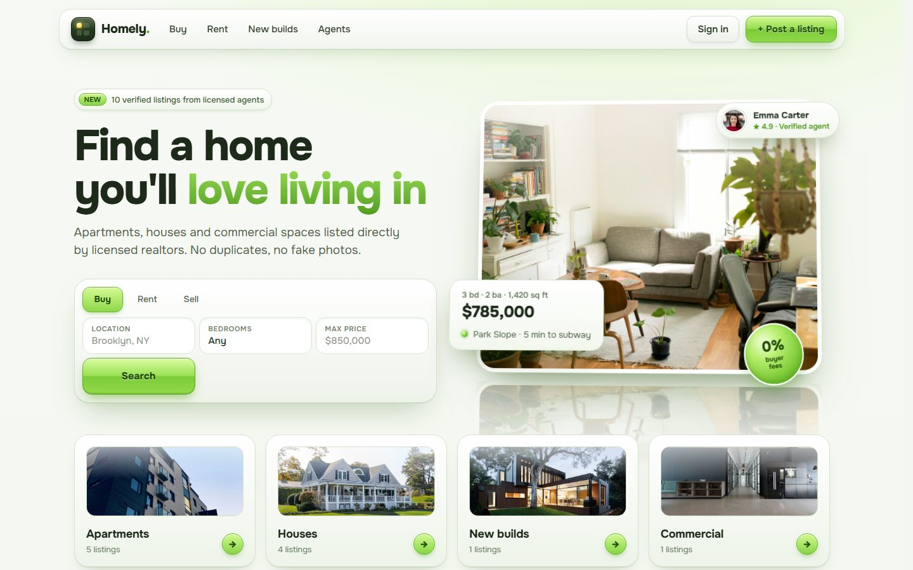

</div>

---

## Contents

- [Highlights](#-highlights)
- [Screenshots](#-screenshots)
- [Architecture](#-architecture)
- [Engineering decisions](#-engineering-decisions)
- [API](#-api)
- [Getting started](#-getting-started)
- [Quality checks](#-quality-checks)
- [Project structure](#-project-structure)

---

## ✨ Highlights

| For clients | For realtors | Under the hood |
|---|---|---|
| Catalog with filters: location, property type, features, bedrooms, price, verified agents | Create listings with photos (drag in, sent as base64) | Laravel 13 with **laravel-data** DTOs, **Action** classes and `#[Middleware]` / `#[Authorize]` attributes |
| Listing page with gallery, fullscreen viewer, mortgage calculator | Leads inbox — messages from "Contact agent" forms | **Sanctum** token auth, roles *client / realtor / admin*, Policies |
| Agents directory with filters by specialization, area, language, rating | Mark a deal as sold — it moves to the "Sold" tab of the profile | **Pest** feature tests, **Larastan** static analysis, **Pint** code style |
| Save favorites ♡ without an account | Unverified realtors' listings stay drafts until the license is checked | Nuxt 4 **SSR**, Pinia, Tailwind v4, typed API layer, `vue-tsc` |

The UI is a pixel-level implementation of the **Homely** design mockup — including its 3D tilt cards, preloader and scroll reveals — made fully responsive down to 320 px.

---

## 📸 Screenshots

### Home

Fresh listings with category filter, top agents and the realtor call-to-action — all numbers come from the API.

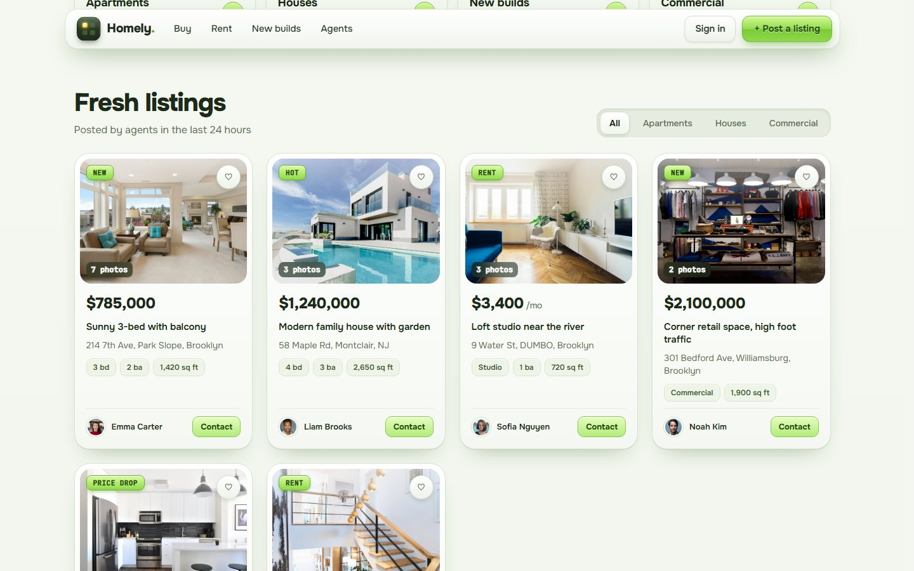

### Search

Filters live in the URL, so a search can be shared or bookmarked. Active filters become removable chips.

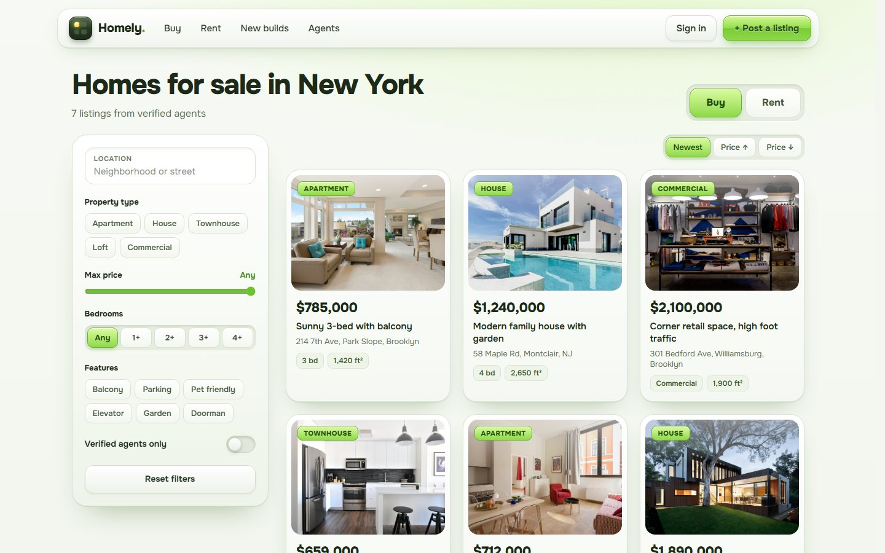

### Listing

<table>
  <tr>
    <td width="50%">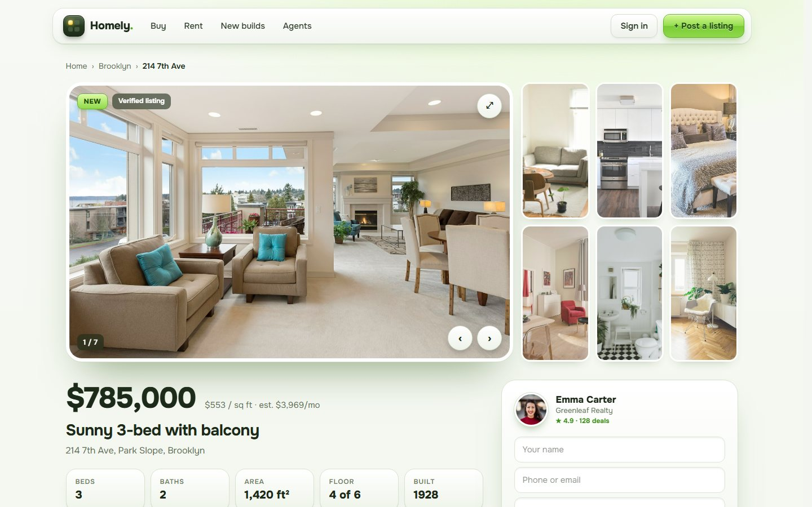</td>
    <td width="50%">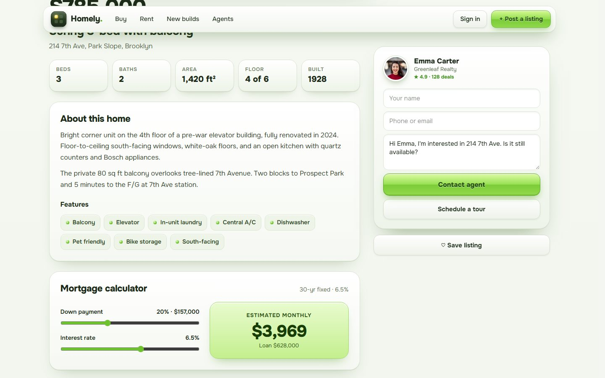</td>
  </tr>
  <tr>
    <td align="center"><sub>Gallery adapts to 1–7+ photos · sticky agent card with a real contact form</sub></td>
    <td align="center"><sub>Features, mortgage calculator, similar homes</sub></td>
  </tr>
</table>

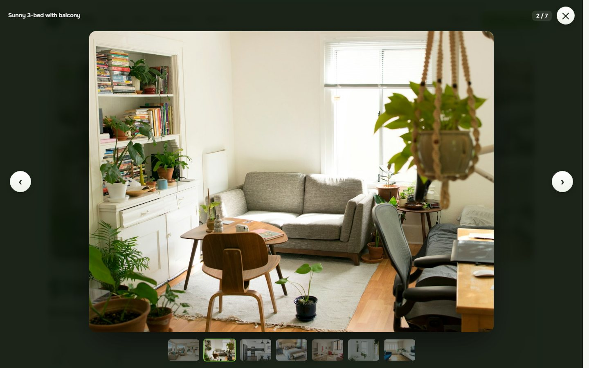
<p align="center"><sub>Fullscreen viewer — arrows, keyboard (← → Esc), swipe on touch screens</sub></p>

### Agents

<table>
  <tr>
    <td width="50%">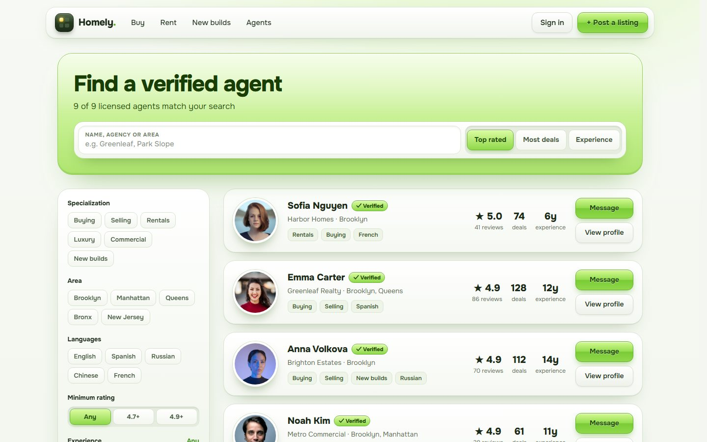</td>
    <td width="50%">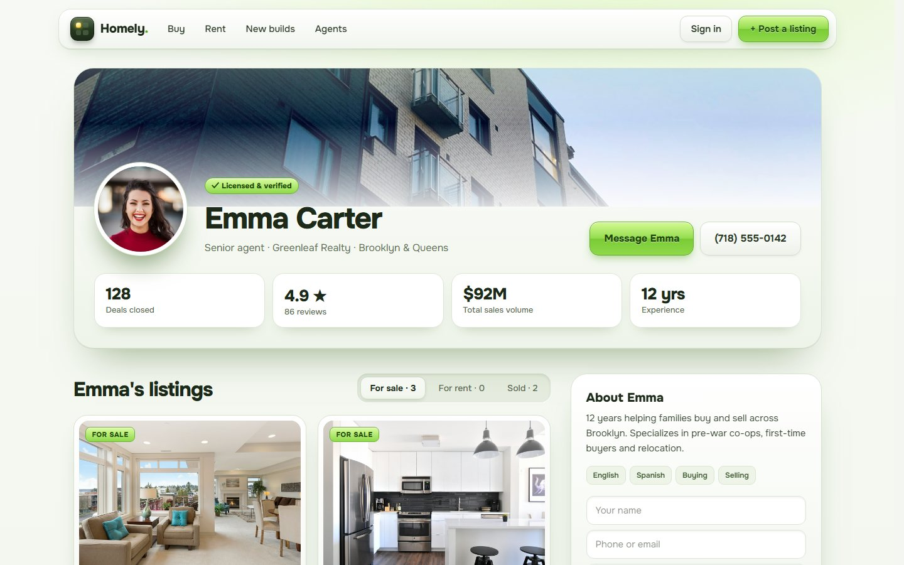</td>
  </tr>
  <tr>
    <td align="center"><sub>Directory: specialization, area, language, rating, experience</sub></td>
    <td align="center"><sub>Profile: stats, listings by status, client reviews</sub></td>
  </tr>
</table>

### Realtor cabinet

<table>
  <tr>
    <td width="50%">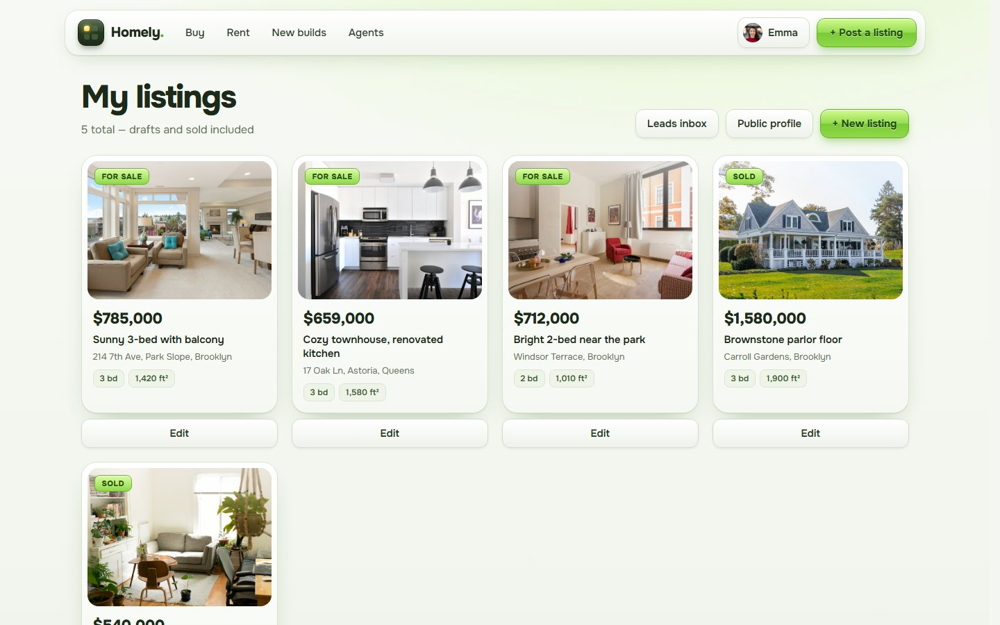</td>
    <td width="50%">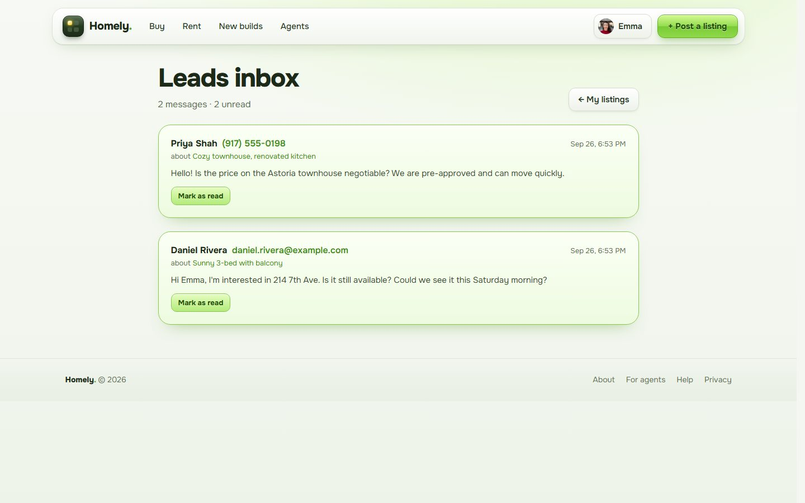</td>
  </tr>
  <tr>
    <td align="center"><sub>My listings — drafts and sold included</sub></td>
    <td align="center"><sub>Leads inbox from "Contact agent" forms</sub></td>
  </tr>
  <tr>
    <td width="50%">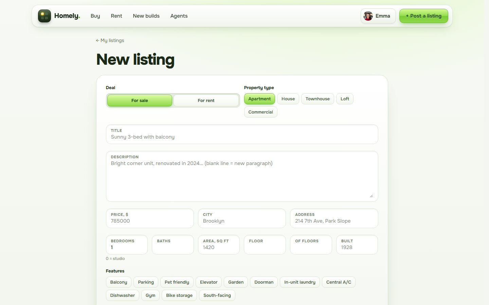</td>
    <td width="50%">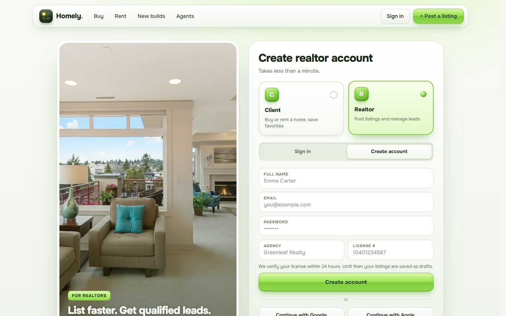</td>
  </tr>
  <tr>
    <td align="center"><sub>Listing form: features, badge, photos as base64</sub></td>
    <td align="center"><sub>Sign up as client or realtor (agency + license)</sub></td>
  </tr>
</table>

### Mobile

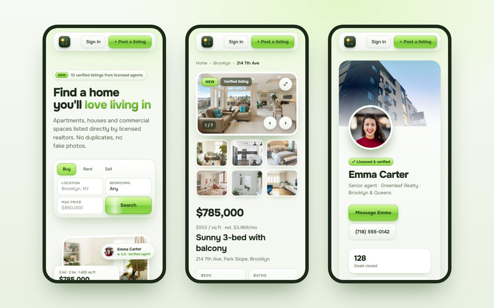

### API docs

Generated from the code by Scramble — available at `/docs/api`.

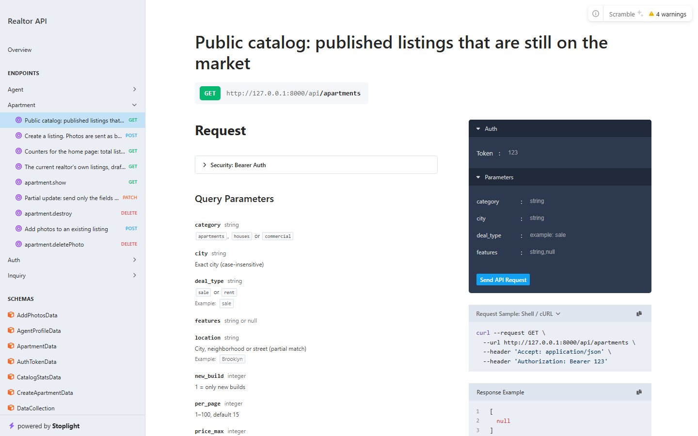

---

## 🧭 Architecture

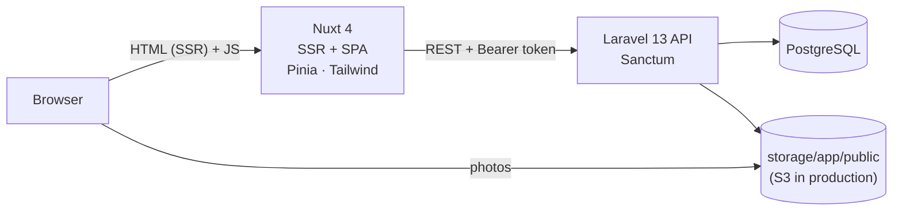

**How a request travels through the backend** — every layer has one job:

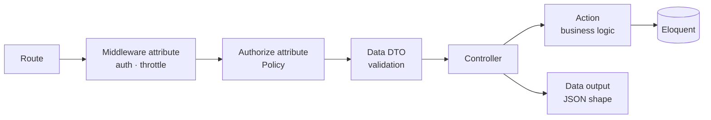

**Data model**

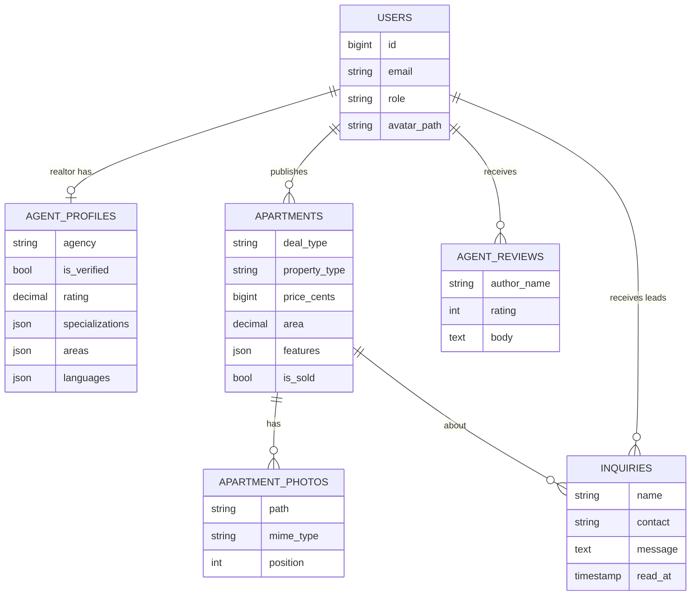

---

## 🧠 Engineering decisions

<details open>
<summary><b>Money is stored as integer cents</b></summary>

`price_cents BIGINT` — never floats, so there are no rounding errors. The UI formats `$785,000`; the mortgage calculator works on the same number.
</details>

<details>
<summary><b>Photos: base64 in, files on disk out</b></summary>

The client sends photos as base64 inside JSON. The API decodes them, **detects the real type from the bytes** (a PHP script labelled `image/png` is rejected), enforces JPEG / PNG / WebP ≤ 5 MB, stores a file under a random UUID name and keeps only the path in the database. If one photo fails, the DB transaction rolls back **and** the already written files are deleted — a rollback alone wouldn't remove them. Switching to S3 is one config value.
</details>

<details>
<summary><b>Validation, authorization and output are separate layers</b></summary>

- **laravel-data** DTOs validate input with attributes (`#[Email, Unique('users', 'email')]`) and shape output — the model is never returned as is (password, e-mails of agents stay private).
- **Policies** hold all "who can do what" rules; controllers declare them with `#[Authorize('update', 'apartment')]`.
- **Actions** (`CreateApartment`, `SearchApartments`, `CreateInquiry`…) hold business logic, so controllers stay a few lines long.
</details>

<details>
<summary><b>No N+1, strict models</b></summary>

`Model::shouldBeStrict()` makes lazy loading, unknown attributes and silently dropped mass-assignment fail loudly in development. Lists eager-load `realtor.agentProfile` and `photos`; home page counters come from **one** query with conditional aggregation instead of five `COUNT`s.
</details>

<details>
<summary><b>Security details</b></summary>

- Mass-assignment protection: `role`, `realtor_id`, `agent_id` are never taken from input.
- Same error for "no such email" and "wrong password"; login, sign-up and contact forms are rate-limited.
- Tokens are Sanctum opaque tokens (hashed in DB) — logout revokes them instantly.
- New realtors start **unverified**: their listings are saved as drafts until the license is checked.
</details>

<details>
<summary><b>Performance</b></summary>

Measured in the browser: page transitions take **40–210 ms**. List pages render immediately with skeletons (`lazy` data loading), a progress bar shows while data loads, API responses take **60–90 ms** locally (OPcache, cached laravel-data structures, optional persistent DB connection).
</details>

---

## 🔌 API

Base URL `http://localhost:8000/api` · send `Accept: application/json` and `Authorization: Bearer <token>`.

| Method | Endpoint | Access | Description |
|---|---|---|---|
| `POST` | `/auth/register` | public | Sign up as client or realtor (agency, license #) |
| `POST` | `/auth/login` | public | Returns a token · 6 attempts / min |
| `GET` | `/auth/me` · `POST` `/auth/logout` | token | Current user · revoke token |
| `GET` | `/apartments` | public | Catalog: `location`, `deal_type`, `category`, `property_types`, `features`, `verified`, `rooms_min`, `price_max`, `sort`, pagination |
| `GET` | `/apartments/{id}` | public | Listing (drafts: owner / admin only) |
| `POST` | `/apartments` | realtor | Create with base64 photos |
| `PATCH` · `DELETE` | `/apartments/{id}` | owner, admin | Partial update (`is_sold` closes the deal) · delete with files |
| `POST` · `DELETE` | `/apartments/{id}/photos[/{photo}]` | owner, admin | Add / remove photos |
| `GET` | `/catalog/stats` | public | Home page counters |
| `GET` | `/agents` · `/agents/{id}` | public | Directory with filters · full profile with reviews and listings |
| `POST` | `/inquiries` | public | "Contact agent" · 5 / min |
| `GET` | `/my/apartments` · `/my/inquiries` | realtor | Own listings · leads inbox |

Full interactive docs: **`/docs/api`** (Scramble / OpenAPI).

---

## 🚀 Getting started

**Requirements:** PHP 8.4, Composer, PostgreSQL, Node 20+.

```bash
# Backend → http://localhost:8000
cd backend
composer install
cp .env.example .env          # set DB_PASSWORD
php artisan key:generate
php artisan migrate --seed    # agents, listings and photos from the design mockup
php artisan storage:link
php artisan serve
```

```bash
# Frontend → http://localhost:3000
cd frontend
npm install
npm run dev
```

**Demo accounts** (password `password`):

| Role | E-mail |
|---|---|
| Realtor | `emma.carter@example.com` (also `liam.brooks@…`, `sofia.nguyen@…`, `noah.kim@…`) |
| Client | `client@example.com` |
| Admin | `admin@example.com` |

> 💡 Local speed-ups: enable OPcache (`opcache.enable_cli=1`) and set `DB_PERSISTENT=true` in `backend/.env`.

---

## ✅ Quality checks

```bash
cd backend && composer check      # Pint (style) → Larastan (types) → Pest (42 tests)
cd frontend && npm run typecheck  # vue-tsc
```

Tests cover auth and roles, catalog filters and sorting, photo validation and file cleanup, agents directory and profiles, leads, license verification and sold listings.

---

## 🗂 Project structure

```
rieltor/
├── backend/                        Laravel 13 API
│   ├── app/
│   │   ├── Actions/                business logic (CreateApartment, SearchApartments, CreateInquiry…)
│   │   ├── Data/                   laravel-data DTOs — input validation & output shape
│   │   ├── Enums/                  PropertyType, Feature, UserRole, Specialization…
│   │   ├── Http/Controllers/Api/   thin controllers with #[Middleware] / #[Authorize]
│   │   ├── Models/                 Eloquent models (strict mode)
│   │   ├── Policies/               authorization rules
│   │   ├── Rules/ · Support/       Base64Image validation & decoding
│   ├── database/
│   │   ├── migrations/
│   │   └── seeders/                HomelySeeder + mockup photos
│   ├── routes/api/                 one route file per feature
│   └── tests/Feature/              Pest
├── frontend/                       Nuxt 4
│   ├── app/
│   │   ├── pages/                  home, search, listing, agents, auth, realtor cabinet
│   │   ├── components/             ListingCard, PhotoLightbox, AuthPanel, …
│   │   ├── composables/ · stores/  useApi (token-aware $fetch), auth store
│   │   ├── plugins/motion.ts       v-tilt / v-reveal directives from the design
│   │   └── assets/css/main.css     Homely design system on Tailwind v4
│   └── Макет сайта риелторов Homely/  the original design mockup
└── docs/screenshots/
```

---

<div align="center">
<sub>Design: <b>Homely</b> mockup · Photos: Unsplash (from the mockup) · Built with Laravel & Nuxt</sub>
</div>
